# 웹툰 추천 서비스 만들기

## 목차

- [웹툰 추천 서비스 만들기](#웹툰-추천-서비스-만들기)
  * [목차](#목차)
  * [개요](#개요)
  * [데이터 수집](#데이터-수집)
    + [텍스트 데이터](#텍스트-데이터)
    + [이미지 데이터](#이미지-데이터)
    + [수집 결과](#수집-결과)
  * [분석(유사도)](#분석\(유사도\))
    + [간단한 EDA](#간단한-eda)
    + [이미지 분석](#이미지-분석)
      + [첫 번째 시도 - CNN](#첫-번째-시도%20-%20cnn)
        + [아이디어](#아이디어)
        + [진행](#진행)
        + [결과](#결과)
      + [두 번째 시도 - CNN](#두-번째-시도%20-%20cnn)
        + [새로 진행하게 된 이유](#새로-진행하게-된-이유)
        + [진행](#진행-1)
      + [세 번째 시도 - CNN](#세-번째-시도%20-%20오토인코더)
        + [아이디어](#아이디어-1)
        + [진행](#진행-2)
        + [결과](#결과-1)
      + [발전 가능성](#발전-가능성)
    + [텍스트 분석](#텍스트-분석)
      + [발전 가능성](#발전-가능성-1)
  * [웹 서비스](#웹-서비스)
    * [진행 상황](#진행-상황)

## 개요

기존 웹툰 플랫폼에서 추천 서비스는 유저 기반으로 이루어져있다. 지지도 기반이나 잠재 요인 협업 필터링 등을 사용하는 것이 일반적일 것이다. 네이버의 경우 남성/여성 인기 웹툰이나 특정 웹툰을 선호하는 사람들이 함께 좋아하는 작품을 추천하는 방식을 사용하고 있다. 카카오 웹툰의 경우 어떤 방식으로 작동하고 있는지는 모르겠으나 특이하게도 비슷한 그림체를 가진 웹툰을 서비스하고 있다.

수집 데이터의 한계(유저 데이터 수집 불가능)와 카카오 웹툰의 추천 서비스에서 영감을 받아, 컨텐츠 기반(비슷한 그림체나 비슷한 스토리)으로 웹툰을 추천해주는 프로젝트를 기획, 서비스 구축을 목표로 진행하였다.

서버에 접속하면 나이대, 성별, 선호하는 웹툰 등의 데이터를 입력 받아 MySQL 등 저장소에 저장을 한 뒤 충분히 데이터가 쌓이면 유저 기반 추천 서비스를 제공하는 것도 생각을 했으나 시간 제약 상 진행하지는 못했다.

유저 데이터를 수집하는 것 대신, 네이버 API의 검색 데이터를 활용하여 어느 연령대와 성별이 웹툰을 많이 검색했는지(=관심이 있는지)를 확인하는 방안도 생각했으나 "캐슬"이나 "광장"처럼 일반적인 단어가 웹툰 제목의 경우 웹툰에 대한 관심인지 확인할 수 없다는 점과 "신과 함께"처럼 영화화/드라마화 된 작품의 경우 웹툰에 대한 관심인지 영화/드라마에 대한 관심인지 알 수 없다는 점 때문에 이번 서비스에는 넣지 않게 되었다.

댓글 같은 데이터를 이용하지 못한 것도 한계점으로 생각한다. 레진코믹스의 경우 댓글 시스템이 없기 때문에 통일성을 위해 제외한 부분도 있었다. 그래도 활용 방안을 생각해본다면 1화의 댓글 반응(총 댓글 개수, 베스트 댓글 추천/반대 수, 댓글 내용 토큰, 벡터화 또는 감성 분석)으로 작품의 별점을 학습하는 모델을 구성하여 신규 웹툰의 1화 반응을 통해 성공할 웹툰일지를 예측해보는 것도 재미있을 것 같다. (\*수집할 데이터 : (2013년 5월 이후에 올라온 1화에 대하여) 댓글 수, 모든 베스트댓글의 수, 내용과 추천, 비추천, 별점 평가 인원, 별점, 최신순 댓글 10개의 내용 \*분석 방법 : 베스트댓글을 임베딩하여 평균 별점 예측+댓글수 등 나머지 수집 데이터로 평균 별점 예측 두 가지 모델을 앙상블하여 최종 예측)

웹툰은 매일 업데이트 되는 데이터이다. 또한 연재 중이던 웹툰이 완결되기도 하며, 신규 연재가 되는 작품이 나오기도 한다. 그럴 때마다 데이터 수집을 반복해야 하지만 여건이 마련되지 않기도 했고, 아래에 설명할 이미지 분석 모델의 경우 학습 시간이 오래 걸림+AWS 서버에서 진행을 했었기 때문에 자동화를 하기에는 한계가 있었다. 이미지나 신규/완결 웹툰에 대한 수집, 정리는 1주일에 한 번, 이미지 분석 모델은 한 달에 한 번 정도 진행하도록 자동화할 수 있다면 지속적인 서비스를 할 수 있을 것이다.

## 데이터 수집

- 네이버 웹툰, 카카오 웹툰, 카카오페이지 웹툰, 레진 코믹스 총 4곳의 웹툰 플랫폼
- 네이버, 카카오, 카카오페이지의 텍스트 데이터와 네이버의 이미지 데이터는 내가 직접 진행하였고 (Scraping 폴더의 대문자로 된 파일들) 그 외 레진 코믹스의 텍스트 데이터, 카카오, 카카오페이지, 레진 코믹스의 이미지 데이터는 함께 프로젝트를 진행했던 강민규님, 김민규님께서 해주셨음.
- 레진 코믹스의 경우 완결 작품과 성인 작품 제외
- 더 많은 시간과 노력을 투입하여 탑툰, 버프툰, 투믹스 등 다른 웹툰 플랫폼 데이터 수집까지 진행한다면 서비스 이용자가 다양한 웹툰을 접하고 서비스에 대한 만족도가 높아질 것.
- 최근 업데이트 날짜 : 2021년 10월 01일

### 텍스트 데이터

- 텍스트 분석을 위한 웹툰의 제목, 스토리, 글 작가, 그림 작가, 장르, 썸네일 이미지 주소, 작품 URL 주소 수집
- 네이버의 경우 `글작가/그림작가`로 이루어져 있고 레진 코믹스의 경우 글, 그림을 따로 출력하고 있어 수집이 편했으나, 카카오는 웹페이지가 아닌 json(API)에 글/그림작가 정보가 들어있고, 카카오페이지는 작품소개를 눌러야 글, 그림, 원작 정보가 나오기 때문에 수집이 까다로웠음

### 이미지 데이터

- 이미지 분석을 위한 작품마다의 회차별 썸네일 이미지 수집
- 그림 작가마다 고유한 그림체가 있다고 가정하여 그림 작가 이름으로 된 폴더를 생성하여 수집
  - 텍스트 수집 때와 같은 이유로, 카카오와 카카오페이지에서의 수집이 까다로웠음(오래걸리기도 함)
- 네이버 웹툰의 완결 웹툰의 경우, 네이버 시리즈로 넘어가 썸네일 확인을 하지 못하는 경우도 많았음(24시간마다 무료 작품의 경우, 모바일 네이버 웹툰 페이지에서 썸네일 확인 가능)

### 수집 결과

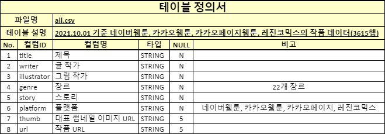

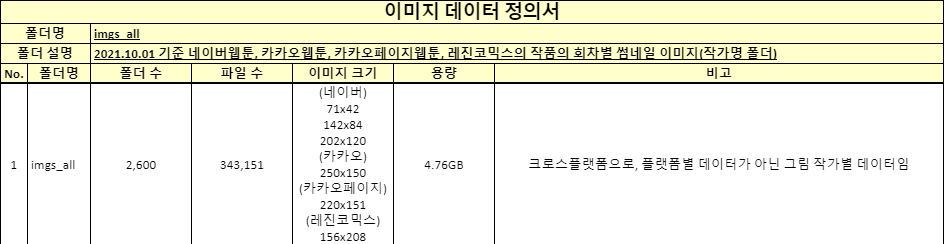

## 분석(유사도)

### 간단한 EDA

- 작가별 진행한 회차 수

  - 평균 131.98회, 중앙값 78회

  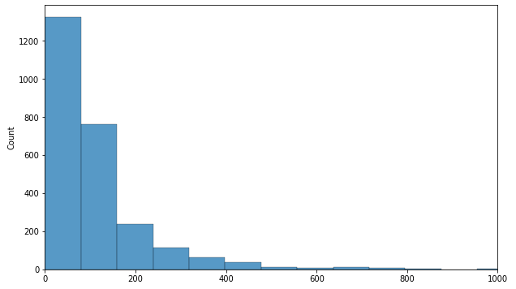

- 진행한 회차가 N화 이상인 작가 수

  - 200화 이상 375명
  - 300화 이상 180명
  - 400화 이상 102명
  - 500화 이상 58명

  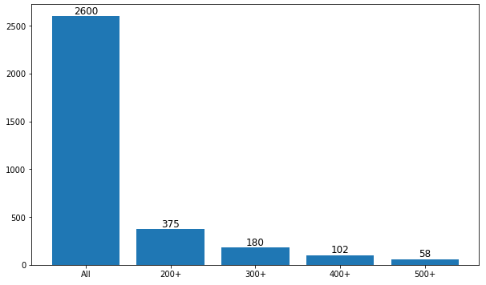

- 플랫폼별 작품 수

  - 총 3602개

  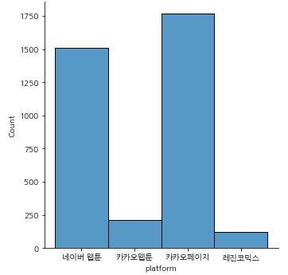

- 작가 수

  - 글 작가 2575명
  - 그림 작가 2572명

  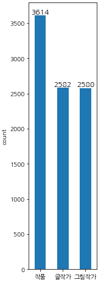

- 스토리 내 단어 빈도수 (WordCloud)

  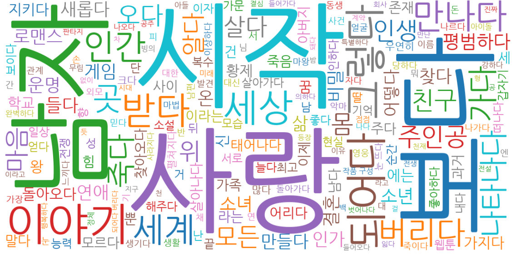

### 이미지 분석

- GPU - Tesla M50, Python - 3.7.6, TensorFlow - 2.4.0에서 진행하였음
- 비슷한 그림체, 작화를 가진 그림 작가를 추천해주기 위하여 작가별 유사도를 구하고자 하였음
- 다른 github나 블로그에서 시도했던 방법을 우선적으로 시도하고자 하였음
  - 스타일 트랜스퍼의 Gram Matrix간 유사도 : 스타일 트랜스퍼에 대한 이해도가 떨어졌기 때문에 보류
  - 텐서플로 허브를 이용하여 특성 벡터를 추출한 후, 코사인 유사도 계산 : 아무리 잘 학습된 모델이더라도 웹툰 이미지의 특성을 추출할 수 있는지에 대한 의문과 구현의 어려움 때문에 보류
  - CNN 모델로 분류 학습을 진행하고 이미지를 넣었을 때 softmax 확률이 높은 작가의 작품과 비슷한 작품일 것이라는 아이디어 : 구현 자체가 쉽고 이해하기에도 무리가 없었기 때문에 이 방법을 채택하고 진행

#### 첫 번째 시도 - CNN

- [ipynb 파일](Image%20Recommendation\CNN_over500_42.ipynb)

##### 아이디어

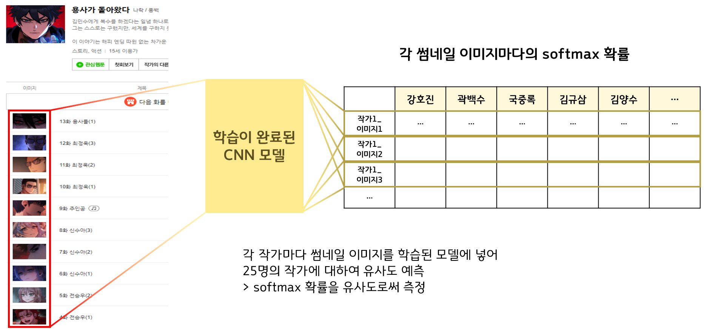

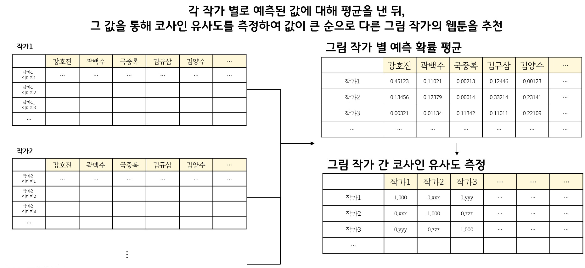

##### 진행

- 이미지 수가 충분해야 하기 때문에, 500화 이상 진행한 그림 작가에 대하여 분류 학습을 하였음

- 42x42 이미지로 학습

  - 이미지의 가장 작은 크기가 71x42였기 때문에 그에 맞춰서 이미지 크기를 줄여서 학습하였음

- 이미지 증강 90도까지 회전시켰음 (거꾸로 있는 인물 그림 등이 있기 때문에)

- 데이터 클렌징(휴재 썸네일이나 성이나 집 등 배경만 있는 장면 등을 지우는 작업)과 모델 파라미터(레이어 수, 유닛 수, 드랍아웃, 배치노말, 규제 등)을 바꿔가며 2~30번 이상 훈련을 진행

- 최종 모델

  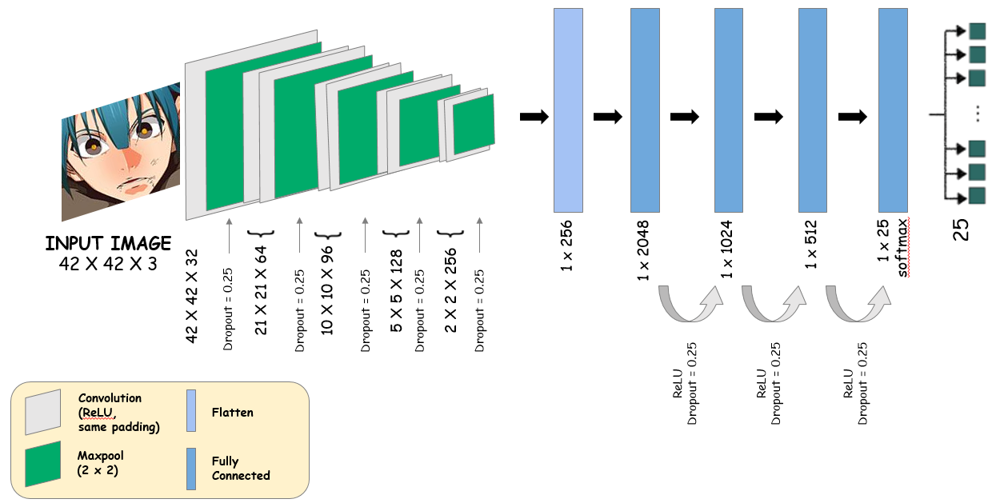

- 정확도가 80% 정도로 꽤나 높게 나온 것을 확인, 추천 시스템을 구축하였음

##### 결과

- [ipynb 파일](Image%20Recommendation\웹툰_추천_CNN.ipynb)
- 개인마다 느끼는 것이 다르겠지만 얼추 비슷한 그림 작품을 추천하는 듯 보였음
- 그러나 흑백 작품의 경우 학습 라벨(작가) 중 박바퀴 작가의 것으로 99% 확률로 판정하여 흑백 작품끼리는 모두 큰 유사도를 나타냄
  - 학습 이미지에 흑백 작품이 박바퀴 작가밖에 없었기 때문

#### 두 번째 시도 - CNN

- [ipynb 파일](Image%20Recommendation\CNN_450_540_42.ipynb)

##### 새로 진행하게 된 이유

- 위에서 언급한 흑백 작품에 대한 유사 작품 추천이 별로였기 때문
- 특정 작가의 경우 2000화가 넘어가기 때문에, 데이터 불균형 문제가 있다고 판단하여 모두 비슷하게 작가별로 500~600개의 이미지로만 학습을 진행

##### 진행

- 같은 모델로 학습을 해보았지만 정확도가 40% 정도에서 향상되지 않음
- 그 이유로, 그림체가 바뀌는 작가(김인호, 연제원 작가 등)가 있기 때문이라고 판단하여 임의로 김인호\_1, 김인호\_2 등으로 분리하여 500화가 넘는 것에 대하여 재학습
- 그러나 정확도가 5~60%에서 상승하지 않았기 때문에 다른 방법을 시도하게 되었음

#### 세 번째 시도 - 오토인코더

- [ipynb 파일](Image%20Recommendation\autoencoder_40.ipynb)

##### 아이디어

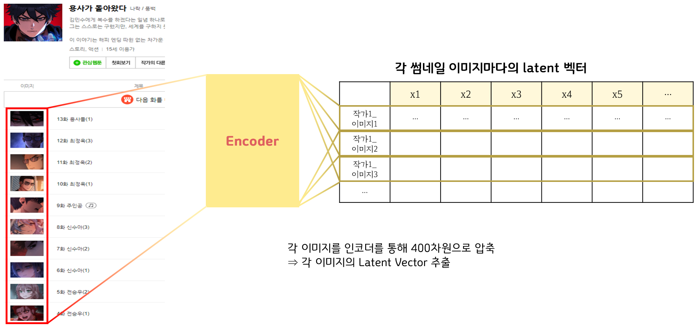

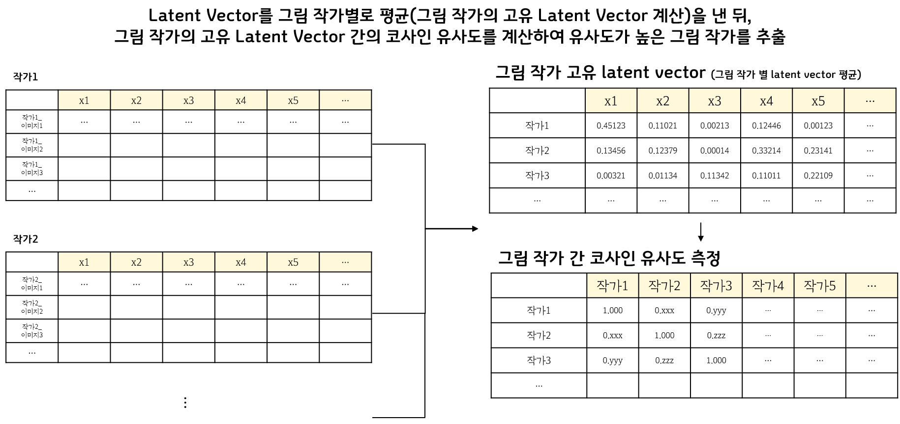

##### 진행

- 40x40 크기로 학습

  - 이미지 크기를 원래대로 복원하기 위해선 2^(레이어 수-1)로 나누어 떨어져야 했기 때문에 42x42가 아닌 40x40으로 진행

- 최종 모델

  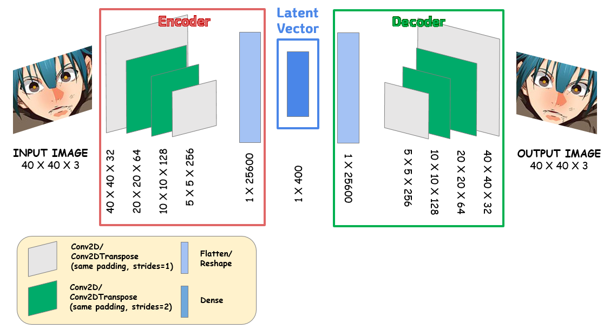

##### 결과

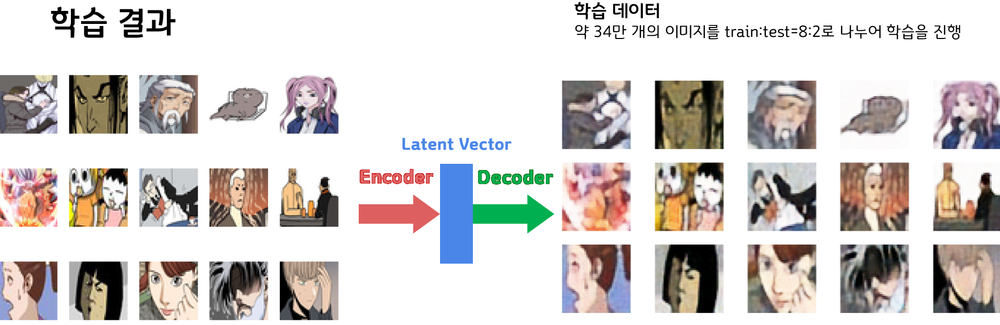

- [ipynb 파일](Image%20Recommendation\웹툰_추천_autoencoder.ipynb)
- 40x40 이미지 자체가 뭉개지는 경향이 있었으나 어느 정도 만족하고 진행하였음
- CNN 모델 때와 달리, 같은 흑백 이미지라도 다른 웹툰을 추천해주었음
- 그러나 박바퀴 작가의 경우 완전 다른 작품이 추천되어 의아한 점이 있음
- 코사인 유사도와 유클리드 거리 두 경우를 생각함. 두 방법을 통한 추천 결과에 큰 차이는 없었고 코사인 유사도가 더 직관적이기 때문에 코사인 유사도로 웹툰을 추천하기로 하였음

#### 발전 가능성

- 더 큰 GPU 메모리와 더 많은 시간이 있었다면 100x100 혹은 그 이상 크기의 이미지를 학습, 400차원보다 더 큰 차원에서부터 복원하여 더 정확한 결과(비슷한 웹툰 추천)를 내놓을 수 있지 않을까 함(시도는 해보았으나 시간 제약으로 오차를 줄이기 위한 파라미터를 다양하게 바꾸는 것은 해보지 못했음)
- 그림체가 달라지는 작가에 대하여 분리를 하고 잠재 벡터 평균을 구하는 것

### 텍스트 분석

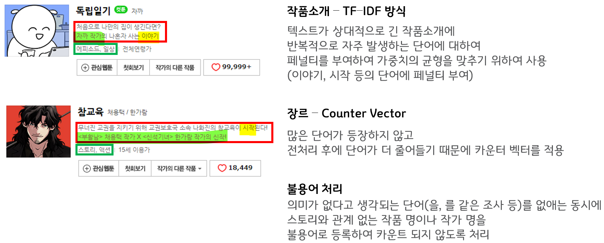

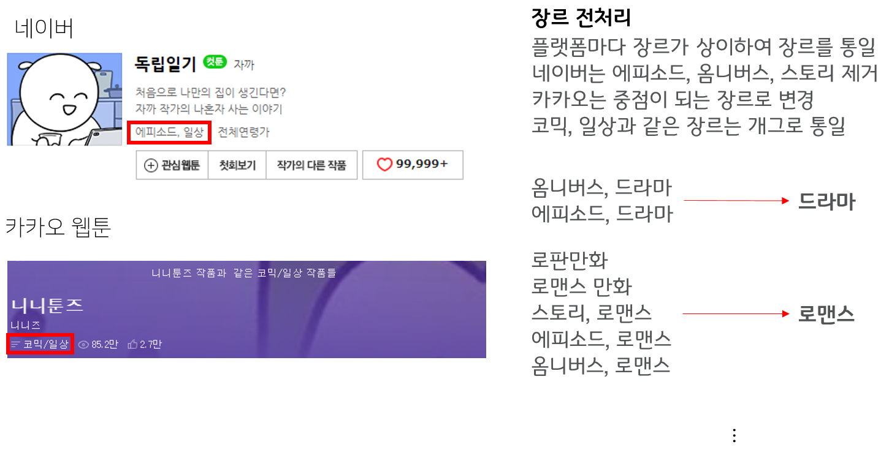

- 작가 이름은 라벨 인코더로 인코딩 후 스토리, 장르, 작가 행렬을 모두 합한 뒤 코사인 유사도를 구함
- ngram range=(1, 2)
- 결과는 애매함
  - 소개글(스토리)이 너무 짧은 작품도 많다는 점
  - 아무리 장르를 통일하더라도 "소년만화" 같은 경우, 네이버 장르에 맞춰 바꾸기에는 애매함. 그렇다고 네이버 작품에 "소년만화"를 추가하기에는 작품 하나하나의 스토리를 알고 있어야 하기에 힘듬. 이 때문에 추천 결과에 결국 "같은 플랫폼"의 작품이 우선적으로 나오고 마는 결과가 되어버림.
  - 그렇다고 장르를 제외하면 앞서 말한 소개글이 짧은 경우 때문에 실제로 유사한 작품이 나오지 않게 되어버림
  - "만화", "작가" 등을 불용어로 등록하였으나, 작품의 주인공이 "만화" 속에 있거나, "만화"를 그리는 "작가"인 경우가 있어 이런 작품들은 결국 핵심 단어가 빠지게 되고 추천을 받지 못하게 됨

#### 발전 가능성

- 모든 웹툰 플랫폼의 작품을 모아둔 사이트에서 장르를 독자적으로 통일시켰기 때문에, 그 장르를 스크래핑하여 사용하는 방안
- 수작업으로 XXX 작품의 OOO작가 등 소개문을 지우고 벡터화 진행(만화, 작가 등을 불용어로 등록하지 않아도 되도록)
- LDA를 진행하여 군집화 및 군집 내 핵심 단어를 추출하여 새로운 장르로 배정한 뒤 벡터화 진행
  - 네이버 웹툰에 한정하여 LDA를 진행해 보았으나 좋은 결과를 나타내지 못했으며, 그나마 장르를 구분한 뒤 진행했을 때 나름 괜찮은 군집으로 묶였으나 새로운 장르로 배정하기 위하여 장르로 나눠서 LDA를 진행한다는 것 자체가 모순됨
- 소개글이 짧은 웹툰에 대하여 블로그나 커뮤니티 사이트에서 웹툰에 대한 스토리 요약을 수집하여 벡터화(신규 웹툰의 경우 없을 수 있다는 단점이 있음)

## 웹 서비스

- Django 이용
- MySQL이나 MongoDB에 수집한 이미지를 저장하여 화면에 띄우는 것이 베스트지만, 솔직히 말하면 실력이 부족하여 거기까지 진행하진 못하였고 수집한 실제 이미지 주소를 가져와서 출력하는 것으로 함
- 부족한 점 : 웹툰은 모바일 이용자가 많은데, 모바일에 맞는 페이지 제작을 하지 못했다는 점
- PythonAnyWhere를 이용하여 실제 서비스를 시도
  - http://woojangchang.pythonanywhere.com/main/

### 진행 상황

- 211008

  - 기존 웹 서비스는 부족한 점이 많았음

    - 상위 10개 작품만 추천, 지저분한 디자인, 페이지에 빈 공간이 많음 등

    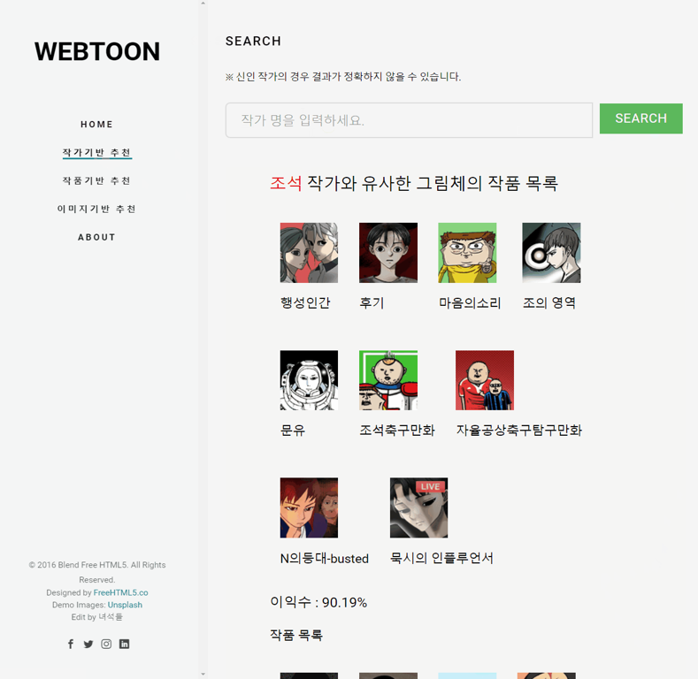

  - 새로운 템플릿을 이용하여 더 깔끔한 디자인을 활용하고자 함

- 211009

  - card를 이용하여 페이지가 좀 더 깔끔해짐

  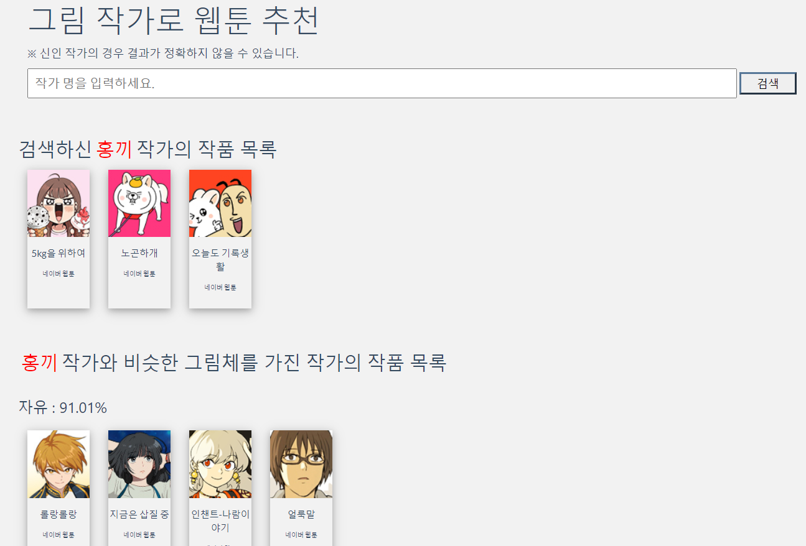

  - Paginate를 사용하여 상위 10개 작품만이 아닌 그 아래 작품들도 확인할 수 있게 함(대신 페이지 로드가 느려짐)

    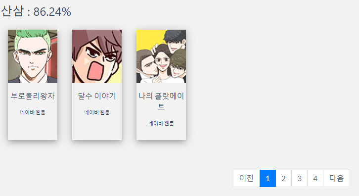
    
  - 실제로 쓸 사람이 있을지 모르겠으나, 인코더 모델(h5 파일)을 다운 받을 수 있도록 하는 링크 생성

- 211010

  - 스토리, 이미지 입력으로 웹툰을 추천해주는 페이지도 그림 작가로 웹툰 추천해주는 페이지처럼 깔끔하게 정리

  - 유사한 스토리/장르 추천 페이지에서 프로젝트 기간 때 넣고 싶었지만 HTML 미숙으로 넣지 못했던 가중치 입력칸을 추가

    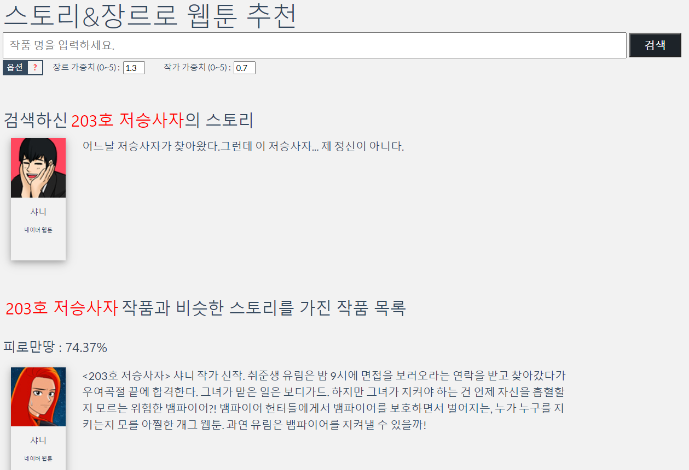

  - ABOUT을 누르면 깃헙으로 이동하게

  - Help를 누르면 모델에 대한 설명 페이지로 이동
  
- 211011 : pythonanywhere 사이트를 이용하여 웹 서비스 구현

  - 용량 제한(500MB) 때문에 패키지 설치가 되지 않아 그림 작가로 웹툰을 추천하는 페이지밖에 작동되지 않음

